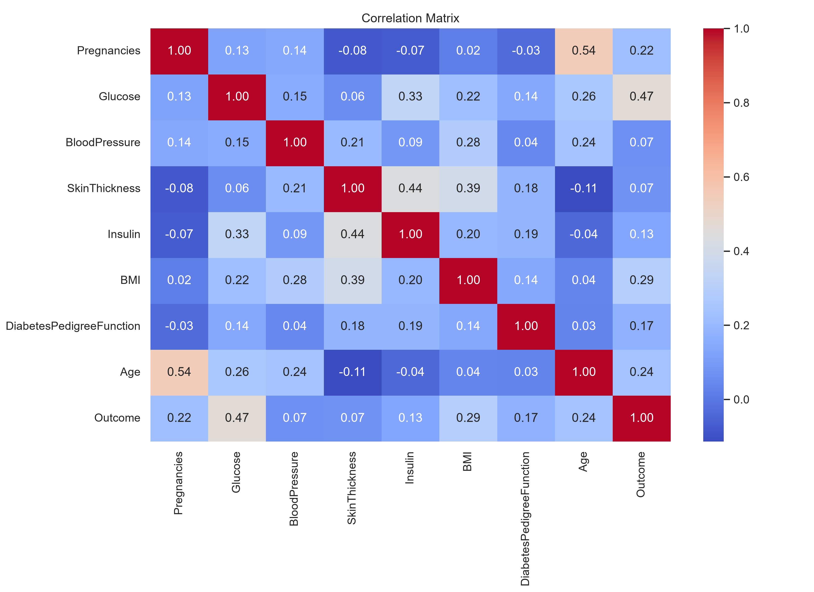

# Diabetes Prediction
This project uses machine learning to predict whether a person is likely to have diabetes based on health-related features.
   The project uses the Pima Indians Diabetes Database, a publicly available dataset.
I built this project as a practical exercise in data analysis and machine learning. It helped me practice preparing data, exploring the dataset, training classification models, and comparing their results.
## Tools
* Python
* Pandas
* NumPy
* Matplotlib & Seaborn
* Scikit-learn
* Jupyter Notebook
## What I Did
 Explored and cleaned the dataset
 Used Matplotlib and Seaborn to create visualizations and understand the data
 Prepared the features and target
 Split the data into training and testing sets
 Scaled the features using StandardScaler
 Trained classification models
 Compared and evaluated the models
## Project Image

## How to Run
```bash
pip install -r requirements.txt
jupyter notebook
```
Open the notebook and run the cells in order.
## Author
**Gebiyaw yigermal** — Computer Science&ML/
Data Science enginner.
